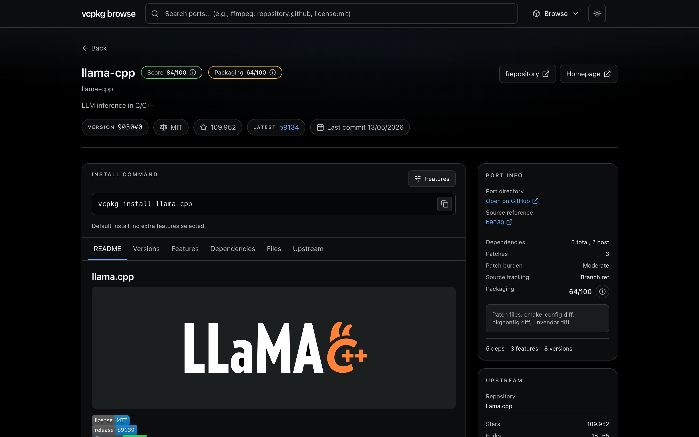

# vcpkg-browser

A local search and inspection UI for the [`microsoft/vcpkg`](https://github.com/microsoft/vcpkg) registry.

`vcpkg-browser` clones the vcpkg registry, parses ports and versions into SQLite, and exposes the catalog through a React UI and Fastify API. It is built for questions that are awkward to answer from the raw repository alone:

- Which ports match `repository:github license:mit`?
- When did a port last change in vcpkg?
- What target and host dependencies does a port declare?
- What upstream repository does a port track, and how active is it?
- How much patching or packaging risk does a port carry?



## What it does

`vcpkg-browser` turns the vcpkg registry into a local, queryable catalog.

It indexes registry data, version history, manifests, portfiles, usage files, patches, and optional GitHub metadata so you can inspect ports without jumping between `ports/`, `versions/`, git history, and upstream repositories.

## Features

- Search ports by text and filters such as `repository:`, `stars:`, `license:`, `supports:`, `feature:`, and `updated:`
- Inspect port details, including manifest data, features, dependencies, usage notes, source references, install commands, and file views
- Browse historical versions resolved from the vcpkg versions database and recorded git trees
- View popular ports, recently added ports, recently updated ports, triplets, and releases
- Review patch burden, source tracking, packaging risk, and maintenance score signals
- Optionally enrich ports with GitHub stars, forks, issues, pull requests, releases, commit activity, and README content

## Workspace

| Path | Purpose |
| --- | --- |
| `apps/web` | React 19, Vite, Tailwind CSS v4, Radix UI |
| `apps/server` | Fastify API, Drizzle ORM, SQLite |
| `apps/worker` | Scheduled sync and enrichment jobs with Bree |
| `packages/vcpkg-parser` | Manifest, portfile, versions, usage, and supports parsing |
| `packages/scoring` | Maintenance and packaging-risk heuristics |
| `packages/github` | GitHub client and enrichment helpers |
| `packages/db` | Database schema, migrations, and DB client |
| `packages/shared` | Shared API types, constants, and utilities |

## Getting started

### Requirements

- Node `24.15.x`
- pnpm `11.1.0`
- Git

### Local setup

Install dependencies:

```bash
pnpm install
````

Create your local environment file:

```bash
cp .env.example .env
```

Run database migrations:

```bash
pnpm db:migrate
```

Build the shared packages and perform the initial vcpkg sync:

```bash
pnpm job -- sync-vcpkg
```

Start the web app, API, and worker:

```bash
pnpm dev
```

Open the app:

* Web UI: `http://localhost:5173`
* API: `http://localhost:3000`
* Swagger UI in development: `http://localhost:3000/docs`

### Optional GitHub enrichment

Set `GITHUB_TOKEN` in `.env` if you want upstream metadata during the initial load, then run:

```bash
pnpm job -- refresh-github-full --refresh-all
```

Without a token, the catalog still works. GitHub-derived metadata is best-effort and depends on upstream detection quality and API availability.

## Rebuilding local data

The `./data` directory only contains generated local state:

* the SQLite catalog
* the local `microsoft/vcpkg` clone

To rebuild from scratch, remove `./data` and run:

```bash
pnpm db:migrate
pnpm job -- sync-vcpkg
pnpm job -- refresh-github-full --refresh-all
pnpm dev
```

Notes:

* `pnpm db:migrate` recreates the SQLite database file.
* `pnpm job -- sync-vcpkg` reclones or refreshes the vcpkg registry and repopulates catalog-derived data.
* `pnpm job -- refresh-github-full --refresh-all` is optional. Use it when you want GitHub enrichment immediately instead of letting the worker fill it in over time.

## Docker

Build and run the production stack with Docker Compose:

```bash
docker compose up --build
```

The compose setup runs:

* `migrate` to apply database migrations
* `server` to serve the API and built web app on `PORT`, defaulting to `3000`
* `worker` to keep the catalog fresh

Persistent generated data is stored in `./data`.

## Environment variables

Copy `.env.example` to `.env`.

| Variable         | Purpose                                                             |
| ---------------- | ------------------------------------------------------------------- |
| `DATABASE_FILE`  | SQLite catalog path                                                 |
| `VCPKG_REPO_DIR` | Local clone of `microsoft/vcpkg`                                    |
| `VCPKG_REPO_URL` | Registry remote URL                                                 |
| `VCPKG_BRANCH`   | Registry branch to index                                            |
| `GITHUB_TOKEN`   | Optional token for upstream enrichment and higher GitHub API limits |
| `GITHUB_README_SOURCE_MODE` | README source strategy: `snapshot` (default, package-pinned ref) or `latest` (default branch) |
| `PORT` / `HOST`  | Fastify bind settings                                               |

## How indexing works

1. The worker clones or updates `microsoft/vcpkg`.
2. It parses ports, version files, usage files, patches, and portfiles into structured records.
3. It stores the catalog in SQLite.
4. Optional GitHub refresh jobs enrich upstream repository metadata.
5. Catalog-derived maintenance signals are computed during sync.
6. The Fastify server exposes read APIs, and the React app renders the catalog.

The worker also schedules recurring sync, GitHub refresh, score recomputation, and cleanup jobs.

## Useful commands

```bash
pnpm dev
pnpm build
pnpm typecheck
pnpm test

pnpm db:migrate

pnpm job -- sync-vcpkg
pnpm job -- refresh-github-hot
pnpm job -- refresh-github-full
pnpm job -- maintenance --scope catalog
pnpm job -- cleanup
```

`pnpm dev`, `pnpm build`, and `pnpm typecheck` run through Turborepo, so package builds are ordered from the workspace graph instead of being hand-orchestrated by root scripts.

## Repository layout

```text
apps/
  server/   Fastify API
  web/      React frontend
  worker/   Sync and enrichment jobs

packages/
  db/            Drizzle schema and migrations
  github/        GitHub data access
  scoring/       Maintenance scoring
  shared/        Shared types and constants
  vcpkg-parser/  Registry parsers

data/
  catalog.sqlite
  vcpkg-repo/
```

## Limits and caveats

* Registry support expressions are declared support, not proof that a port builds on every triplet.
* Historical pages depend on the git tree recorded in the vcpkg versions database.
* GitHub-derived metadata is best-effort and depends on upstream detection quality, API availability, and rate limits.
* Maintenance and risk signals are heuristics. Treat them as inspection aids, not release guarantees.
